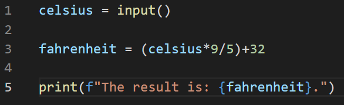

# Q1. 

Before answering the common and important components and concepts of markup language, we need to know what this makeup language. Markup language is a language that annotate text so the computer can organise how it looks on the web page. There are many kinds of markup language

- html (Hypertext markup language)
- Kms (key whole markup language)
- MathML (mathematical markup language)
- SGML (standard generalised markup language)
- XHTEML ( extensible hypertext markup language)
- XML ( extensible markup language)

They are all using open and close tags (<>) , it used to differentiate the actual content and markup instructions. It use semantic elements (example < header >, < p >, < b > …) to make easier meaningful to understand the code. 


# Q2.

The packets is a basic unit of data transfer over the internet, can be grouped together by the computer and device that receive them. The main structure of the packets will contain Header, Payload and sometimes Tailer. The main advantage of packets using is instead of sending a big data, sending in smaller packets are more practical and efficient. All those packets can take different network paths to the same destination. It improve the bandwidth usage.

IP address is Internet Protocol address, which is connecting your device with the internet, so you can deliver and route your online requests. There are two type of the IP address, IPv4 is the most common type. It consists of four of 1 to 3 digits numbers seperate with single dot. Although it supports approximately 4.3 billion unique IP addresses, still have the chance of running out of addresses since the number of devices connecting to the internet grow so fast like smart phone, watch and tablet, even the fridge and single light bulb. That’s why IPv6 came out, it consists of eight groups of four hexadecimal digits. Theoretically means the number of IP addresses will never running out. 

Routers are the network hardware devices which use to forward the data packet to the destination. It connects lots of IP address and let the data pass between them.
Routing is a table or map which decide how to route packets in the network. Good routing table can accelerate the online experience, make it more secure and efficient.

Domain is a string of text for your website. 
DNS is Domain Name System. It is mapping human friendly domain name with numeric IP address.  So people don’t need to remember the IP address. Once you registered a domain, you gain the full ownership of it. It helps the company establish the credibility.


# Q3. 

TCP is Transmission Control Protocol, it provides reliable transmission of packets. It commonly used on top of IP, so it’s part of TCP/IP suite. The main purpose of TCP is to ensure data are not lost or damaged during the transmission. And reassemble the packets in correct order a the recipient. The three-way handshake used on TCP protocol operations.

HTTP  HyperText Transmission Protocol is a client and server protocol, which request by the web browser for getting information like text, image on the internet. When the client send the HTTP request, they will establish a TCP connection. The server will process the request and return an HTTP response to the client. HTTP protocol defines 8 methods to get and update content
- head
- get
- post
- put
- patch
- delete
- trace
- connect

HTTPS use a digital certificate to secure the connection between client and server preventing the sensible data stealing during the transfer. 

Web browser is an application software which display www (World Wide Web). It create the request and response connection between the browser and server, and use the rendering engines to turn the code into the readable and user friendly interface display on the device. Each web browser has its own build in developer tool. It helps the developer easy to diagnose and debug the page and improve the productivity of development life cycle.


# Q4. 

Lists are using square brackets [] to store multiple items. The items in the list are ordered, mutable and allow duplicate values. Because it is ordered, each items in the list is accessible by its indexed location. Index of 0 will be the first item and index -1 will be the last. You can modify (add, delete and change) items in a list because it is changeable. If you want to process items in a specified order and access by its position, List is a preferred data structure.

Tuple are pretty similar compared with List, it use ( ) brackets to store multiple items. Cause the items are ordered, you can access by its indexed location. But the only difference between Tuple and List is Tuple is unchangeable or what we call it immutable. That means once we create a tuple, we can’t modify the contents. The advantage of using tuples will be memory saving. It’s faster than List. The most common way to use tuple is using as dictionary keys for an array of elements.

Dictionary is used to store data in key and value pair. It use { } brackets and : to seperate key and value. Before Python version 3.7, Dictionary is unordered. But now it’s ordered and can access by its indexed location. The difference between Dictionary and List is duplicates are not allowed in Dictionary. In other words, the elements in it are unique. If you want to determine if the object is present or not, probably use Dictionary. Cause the Hash maps are faster to do so.

# Q5. 

Both of the complier and interpreter are used to convert the high level language to machine code.

Compiler generate .exe file. All the program code is already translate to machine code. It usually take large amount of time to analyse the code. It is less flexible because compiled programs can only run on computers that have the same architecture as the computer on which they were compiled. But it runs code faster than interpreter. C and C++ are most popular programming language uses compilation model.

Interpreter is easier, it doest’t need time to preprocessing the code, it covert code line by line, therefore the program execution is slower than the compiler, but it is easier to debug and revise. The typical interpreted language is Python and JavaScript. I think the VS code we used in this course is one of the interpreter, it give you the instant result when you are changing one line of code. It is suitable for web development environment based on the importance of load times.


# Q6. 

The two commonly programming languages I choose is C++ and Python.

C++ is a high-level general-purpose programming language created by Danish computer scientist Bjarne Stroustrup as an extension of the C programming language. 

Python is and interpreted, object-oriented, high-level programming language.

The benefits of C++ : 
1. The running speed is faster especially for the real-time software or time-effective programs, cause it is pre compiled, doesn’t need interpreter.
2. Developer can run the same program on different OP.
3. It’s both low-level and high level language, can develop apps and games, also can make drivers.
4. Easy to switch to other language, cause the syntax are similar.


The drawbacks of C++:
1. Don’t have garbage collector. The pointers can use up a lot of memory
2. A bit hard for the beginner to learn C++
3. Lack of security as data is global
4. Debugging application is complex


The benefits of Python:
1. Beginner friendly, easy to learn and read
2. Increase the productivity (don’t need to declare the variable when you code)
3. Simplified the project with the build-in Python library. 
4. Free, Open source and has the most supportive communities
5. Portable on different platforms and systems with interpreter
6. Python has a good memory management (garbage collector)

The drawbacks of Python:
1. Execute code slow cause it’s not a complied language, it is interpreted language.
2. Python designed as a server side programming, so making mobile applications will be its weekness
3. Time consuming during the test
4. Cause you don’t need to declare variable as static when coding, can have runtime error


# Q7. 

## 1. Access user's information

The collection and storage of personal information on computers or cloud base system is unavoidable nowadays. From shopping online, applying for an educational course to attending the dentist, consumers provide personal information that is stored one way or the other by institutions, private companies and the government. People who provide this information entrust us with their information and is entitled to have their privacy protected and personal information properly collected, stored and used. In addition to that only information that is needed should be collected and you must take reasonable steps to protect personal information. The responsibility of safeguarding this information often lies with IT professionals that work for these institutions. People’s privacy is protected in NSW by the following laws

> The privacy and personal information protection act 1998 and The health records information privacy act 2002.

> And Privacy Act 1988

These acts help guide IT professionals in proper conduct and act in a ethical manner in safeguarding personal information, however the act appears to be outdated and vague and needs to be rewritten or updated at the very least as information technology has changed drastically in the past 10 years, let alone from 1988. 


## 2. Intellectual property, copyright.


Intellectual property is the property of your mind and exclusive knowledge. If you develop a new product, service, process or idea it belongs to you and is considered your IP (business.gov.au). A large part of IT professional’s work would involve dealing with IP, for example a computer programmer would be creating copyrighted computer program, a graphic designer would produce copyrighted original art. It is important to understand what is considered IP in order to protect your own work, but also equally importantly to ensure that you are not infringing on other’s IP.  IP in Australia is protected by Australian intellectual property laws and IP Australia is the Australian government agency that administers IP rights and legislations (www.ipaustralia.gov.au). In addition to this, it is important to acknowledge any copyrighted material, with permission granted by the copyright holder, that you use in your own work. 

The acts and regulation help IT professionals act in a ethical manner when it comes to IP protection, however the IP laws consist of a myriad of acts and regulations, it can be very confusing and hard to navigate. IP Australia has developed resources to make navigating IP laws easier, however it is still a time and effort consuming exercise. 

---


## Access to a user’s personal information 

### Optus data breach on 22th September 2022. 


On 22th September 2022, Optus has fallen victim to a cyber-attack which resulted in the disclosure of their customer’s personal information. Optus customer information including names, dates of birth, email adresses, driver’s licences, medicare cards and passport numbers may have been exposed (austral.gov.au). 


This is possibly the largest data breach ever to have affected Australia consumers (moulislegal.com). 


Optus described the attacks as sophisticated and have employed multiple European IP addresses that kept changing during the hack. Though Home affairs minster Clare O’Neil has asserts th attach was “basic” and has criticised vulnerabilities within Optus’ cybersecurity system. The actual way Optus has been attacked is still currently under investigation and results have not been made public (Elvin DuBose, mozo.com.au). 


As the actual method of cyberattack is unclear it is too early to propose ways of mitigating the attack. Having said that an ethical IT professional should be vigilant and up to date with their cybersecurity capabilities in order to prevent cyber attack such as this one. Optus is now proposing to further enhancing their cyber capabilities with a goal of exceeding global standards (optus.com.au), however this is akin to proposing to increasing number of guards at a bank vault only after all of people’s saving has been stolen. 


Furthermore, it is important to note that data of 11 million customer’s data has been stolen of which 2 million are active customers. An ethical IT professional would ensure that data is properly collected, stored and used, collect only information required and take care when handling sensitive information. It is understandable for Optus to collect information for existing users, but the question lie in why Optus has failed to properly delete / dispose of data from previous customers. In addition to that, the data that has been stolen includes people’s driver license numbers, medicare and passport numbers, this leads to the question of the need to store these details beyond initial verification purposes. I believe and ethical IT professional which question the collection and storage of these information and hence potentially mitigate or at least minimise the level of data breach that has occurred. 


It is also worthy to note that the penalty for data breaches in Australia is capped at just over $2million dollars. This is barely a slap on the wrist for the enormity of the data breach. The fine equates to less than $1 for each person’s stolen data, considering the level of distress that it has caused for people affected. Though an IT professional should not be guided only by fines and laws, but if the penalty is in line with the seriousness of the impact then companies such as Optus may take cyber security more seriously. 


# Q8. 

Control flow is the order to determine which block of code in programming language can execute first. It regulated by conditional statements, loops and functions. Booleans are used to control the flow of our program.

Here is the example of nested if statement (from ED challenge)

```py
from datetime import datetime
dt = datetime.now()
x = dt.weekday()
if x == 2:
    print("It's Wednesday")
else:
    date = input("What day is it?")
    if date[-1] != "y":
        print("That's not a day!")
    elif date == "wednesday":
        print("Haha, you're a funny one! See ya!")
    else:
        print("Thankyou for letting me know that today is " + date + "! See ya!")
```

First we import datetime function to get the date of today and the weekday’s number. The main if statement is using to check if today is Wednesday or not, if the argument return a true value, that means today is Wednesday, we print “It’s Wednesday” and exit the program. If it return a false value, the program will go to the next else, and start to execute the code inside the else statement. 

In the else statement, there are some sub if..elif..else statement to control the flow. If the user input last character is not equal to “y”, then exit the program with a notice “That’s not a day!”. If it return a false value, flow to the next elif statement to check if the user input is equal to “wednesday” or not. If it returns false value again, then flow to the next else statement and print out something and exit the program.

That’s how the program execute and flow with different condition statement. 


# Q9. 

Both of them are used to convert the data from one data type to another, the difference is type coercion is converting data automatically, or called implicitly, the type conversion is covering data either implicitly or explicitly.

Type conversion is used in python, like int(), str() python use build-in function  to covert data from one type to anther. Example:
```
X = 23
Y = “102”
X + int(y)
125
```
In this example, x is integer, but y is a string, python doesn’t allow  an integer and a string to be added. So we convert string y to integer int(y).

Is type coercion used in python? The answer is no. The sample will show the addition between an integer number and float number. In python we knows when we add an integer number with a float number, the result is always float number, but it didn’t use type coercion to covert the integer number to a float number. It calls ```__add__``` method and ask them to add together. Example:
```
X = 23
Y = 25.5
Print (x+y)
48.5
```
When python execute the code, it called x.```__add__```(y).
You got NotImplemented back, because int doesn’t know how to do the + operation with float y. After that kind of “error” message, python call y.```__radd__```(x) to add a int number x onto y (a float number), then you got the result 48.5

Therefore python only has type conversion, don’t have type coercion.


# Q10. 

Data type is a form or type of information used for variables, which tell the compiler what kind of data and the amount of space needed in the memory.
In Python, there are 15 built-in data types.

- Text Type: str
- Numeric Types: int, float, complex
- Sequence Types: list, tuple, range
- Mapping Type: dict
- Set Types: set, frozenset
- Boolean Type: bool
- Binary Types: bytes, bytearray, memoryview
- None Type: NoneType

Here is the example of all the data types.


Text type String is surrounded by single or double quotation marks, like ‘Hello’ or “Hello”.  It is a sequence of characters (letters, numbers, whitespace or punctuation). If it is multiline string, you can use three quote like “”” or ‘’’. In python 3.8 and after, all the user input data will be string type even it’s numeric number.

Int, float and complex are numeric type, int type is a whole number without decimals. Float is the opposite with decimals. You can convert int and float by using int() and float() build in function, but be careful when you convert from float to int, you will lose the decimal number and round to whole number. 

Boolean type represent True or False value. It widely used to control the data flow in programming language. Almost every string is True, except empty string, and every number is True, except 0. None value is False, same as empty list, tuple and dict. 

Range type actually is a function return a sequence of numbers, start from the first parameter, stop at the second parameter and increasing number will be the third parameter. Like. range(start, stop, step). Range data type is used to iterate the the data in for and while loops.

Sequence type List is using [ ]  brackets to store multiple items. The items in the list are ordered, mutable and allow duplicate values. Because of it’s ordered, each items in the list is accessible by its indexed location. Index of 0 will be the first item and index -1 will be the last. You can modify (add, delete and change) items in a list because it is changeable.

Sequence type Tuple are pretty similar compare with List, it use ( ) brackets to store multiple items. Cause the items are ordered, you can access by its indexed location. But the only difference between Tuple and List is Tuple is unchangeable or what we call it immutable. That means once we create a tuple, we can’t modify the contents. If tuple only has one item, we need to add a comma after that item.

Mapping type Dictionary is used to store data in key and value pair. It use { } brackets and : to seperate key and value. Before Python version 3.7, Dictionary is unordered. But now it’s ordered and can access by its indexed location. The difference between Dictionary and List is duplicates are not allowed in Dictionary. In other words, the elements in it are unique.


# Q11.

In the question, it says all the staff just quit, so it might include all waitress / waiter and chef. We can create the automatic ordering system to replace the waiter, but still need the chef to cook the dishes. The only option will be invent a cooking robot.

The first class I would use is an ordering menu class. It contain all the food with the price next to it display on the screen. Like the dictionary data type in Python with sets of key and value.

The second class will be the order class. If the person select the food from the menu class, it will add to the order class. People can add, delete food from that class as long as they haven’t press the confirm button. Once they confirmed, the list of food, each one’s price and total price will display on the screen. This class also include the dine in or take away option. If dine in, will ask the customer to grab a table number holder and scan the table number, so the system will know which order belongs to which table. 

The third class will be bill class. Once the customer confirm the order, it will ask they to pay the bill with the amounts shows on the screen. Then it save the receipts information to calculate the revenue later.

The fourth class is the cooking class. The Robot will receive the order from the order class, and prepare each dishes. When the dishes are ready, it will show the table number on the screen or send the SMS to the customer, let them know their order is ready to pickup.


 # Q12.



 The first problem of this code is it doesn’t have a prompt message to indicate what kind of data you ask user to input (number or string). The code is a temperature  formula which convert from celsius to Fahrenheit. So we can let the user know we need a number like “Please input a number: “. In Python3, the input is always string type, we have to covert it to float. But at the same time we still need to check if user’s input is a valid numeric number or alphabetic and numeric mixed number. That is the second problem of this code, so I create a function to check the input data is valid or not. If it’s a valid number then covert it to float and do the calculation, otherwise return a error message and let user know the input is invalid.

 Here is the code link on github in case the wrong identation from copy and paste code. (https://github.com/Jiezhoue/JieZhou_T1A1.git)

```py
def isfloat(num):
    try:
        float(num)
        return True
    except ValueError:
        return False

celsius = input("Please input a number: ")
if isfloat(celsius):
    fahrenheit = ((float(celsius))*9/5)+32
    print(f"the result is: {fahrenheit}.")
else:
    print("Your input is not a valid number. ")

```


 # Q13. 

Here is the code link on github in case the wrong identation from copy and paste code. (https://github.com/Jiezhoue/JieZhou_T1A1.git)

```py
arr = [5,22,29,39,19,51,78,96,84]
i = 0
while (i<len(arr)-1) and (arr[i]<arr[i+1]):
    i+=1
temp_value = arr[i]
arr[i] = arr[i+1]
arr[i+1] = temp_value

print(arr)
```

 # Q14. 


First create an empty list[] to held all the prime number later

Cause number 1 is not prime number, we start from number 2

number 2 is a prime number, so added into list

loop all the number start from number 3 to number 100 (range(3,101))

set a index number i = 2

we check each number when i < num

if num % i == 0 is True, then it is not a prime number, back to main loop (num+1)

if num % i != 0, we increase i by 1 (i+1), and check num % i again (nest loop)

if i >= num, then num is a prime number and add to the list (num+1), back to main loop

if num > 100, exit the main loop and print out the list


 # Q15. 

 Here is the code link on github in case the wrong identation from copy and paste code. (https://github.com/Jiezhoue/JieZhou_T1A1.git)

```py
def weather(raining, temperature):
    match raining:
        case True if temperature < 15:
            return "It's wet and cold"
        case False if temperature < 15:
            return "It's not raining but cold"
        case False if temperature >= 15:
            return "It's warm but not raining"
        case _:
            return "It's warm and raining"

print(weather(True, 13))
print(weather(False, 14))
print(weather(False, 15))
print(weather(True, 34))
```

# Q16. 

Here is the code link on github in case the wrong identation from copy and paste code. (https://github.com/Jiezhoue/JieZhou_T1A1.git)

```py
coding_skill_list = {
"Python" : 1,
"Ruby" : 2,
"Bash" : 4,
"Git" : 8,
"HTML" : 16,
"TDD" : 32,
"CSS" : 64,
"JavaScript" : 128
}

user_skill = {}
coding_skill_score = 0

def user_list(list_1):
    global coding_skill_score
    for key in list_1:
        while True:
            answer = input(f"Do you have {key} Skill: (type 'y' for yes and 'n' for 'no'): ")
            if answer != "y" and answer != "n":
                print("Invalid answer, please type 'y' or 'n' for the answer")
                continue
            else:
                if answer.lower() == "y":
                    user_skill[key] = list_1[key]
                    coding_skill_score += user_skill[key]
                break


user_list(coding_skill_list)
print(f"Your coding skill score is {coding_skill_score}")

improve_list = {}

def improve_skill(list_2):
    for key in list_2:
        if key not in user_skill:
            improve_list[key] = list_2[key]

improve_skill(coding_skill_list)

if len(improve_list) == 0:
    print("You got the full skill, congradulation!")
else:
    for key in improve_list:
        print(f"you can learn {key}, and that give you {improve_list[key]} more score")
```


Reference
1.  network packet https://www.techtarget.com/searchnetworking/definition/packet
2. Without IP Addresses, the Internet Would Disappear https://whatismyipaddress.com/ip-address
3. Domain Name System https://en.wikipedia.org/wiki/Domain_Name_System
4. Compiler vs Interpreter – Difference Between Them https://www.guru99.com/difference-compiler-vs-interpreter.html
5. Python vs C++: Which Is The Best Programming Language? https://www.esparkinfo.com/blog/python-vs-c-plus-plus.html
6. What is Transmission Control Protocol TCP/IP? https://www.fortinet.com/resources/cyberglossary/tcp-ip
7. Web Browser https://www.geeksforgeeks.org/web-browser/